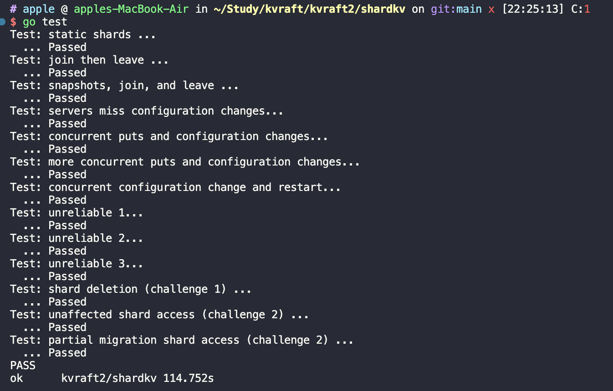

#  项目简介

在 MIT-8.624-Raft 中实现了 [Raft 库](https://github.com/1055373165/MIT-8.624-Raft)；

在 [KVRaft](https://github.com/1055373165/KVRaft) 中实现了使用 Raft 做一致性保证的分布式 KV 服务；

本部分以上面两个库为基础实现了支持分片的分布式 KV 存储系统 shardkv，shardkv 是由多个 Replica Group 组成，

每个 Replica Group 负责一部分 shard 的读写请求，每个 Replica Group 又是一个 Raft 集群，所有的 Group 组合到一起就是一个完整的 shardkv 服务。

# 代码组织结构
```
.
├── README.md
├── go.mod
├── kvraft
│   ├── client.go
│   ├── common.go
│   ├── config.go
│   ├── server.go
│   ├── state_machine.go
│   └── test_test.go
├── raft
│   ├── README.md
│   ├── config.go
│   ├── persister.go
│   ├── raft.go
│   ├── raft_application.go
│   ├── raft_compaction.go
│   ├── raft_election.go
│   ├── raft_log.go
│   ├── raft_persistence.go
│   ├── raft_replication.go
│   ├── test_test.go
│   └── util.go
├── resources
├── shardctrler
│   ├── client.go
│   ├── common.go
│   ├── config.go
│   ├── server.go
│   ├── state_machine.go
│   └── test_test.go
└── shardkv
    ├── client.go
    ├── common.go
    ├── conf_change.go
    ├── config.go
    ├── server.go
    ├── state_machine.go
    ├── task.go
    └── test_test.go
```

# shardkv 介绍
## 核心组件
核心包含以下部分：
- **shardkv controller**
  - 本身也是一个分布式 KV 服务，它存储的是 shardkv 的一些配置信息（比如分片和 group 之间的映射关系，类似于 dragonfly 二开中的 Meta 元数据组件）；
  - 提供了 Query、Join、Leave、Move 方法来控制分片和 Group 之间的关系，然后通过 raft 模块进行各个节点之间的状态同步；
  - 当 raft 模块状态同步完成之后，节点会发送已经 commit 的日志，然后后台 apply goroutine 进行处理，主要是将用户的操作持久化到状态机中。
- **shardkv server**
  - 配置变更：RaftCommand 的一种命令形式，可以根据配置判断哪些分片需要进行迁移、清理，配置变更仅用于改变分片状态而不作分片迁移工作；配置变更时更改 shard 的状态，并且启动一个后台线程，定期获取 shard 的状态，执行实际的 shard 迁移。
  - 分片迁移：记录前一个配置中分片所属的 Group，从原 Group 拉取分片数据到新的 Group 中；
    - 问题 1：shard 迁移涉及网络 IO 可能需要较长时间，apply goroutine 一直阻塞等待；
    - 问题 2：客户端的用户操作也需要 apply goroutine 应用到状态机，在上述情况下也需要等待；
    - 特例：从 G1 拉取一个分片成功而从 G2 拉取分片失败，那么 G1 拉取的分片是否应该正常响应客户端请求？（Quoram 协议）
    - 实验规定：处理配置变更时，如果是未参与的分片则需要继续对客户端提供服务，而不是和其他配置变更中涉及到的分片一起等待配置变更完成后才恢复服务；即便是整体的配置变更未完成，只要分片成功完成了迁移，就可以立即开始提供服务而不用等待配置变更全部完成；
  - 分片清理：当分片数据成功复制到新的 Group 中后，原 Group 中的该分片应该被及时清理掉。
## 主线描述
- shardkv 需要定时从 shard controller 拉取最新配置，然后根据配置来确定哪些 shard 需要迁移和删除，并在 Leader 节点上进行操作，最后通过配置变更通知集群中所有 Follower。
- 拉取完配置之后需要构造一个对应的命令，然后传到 Raft 模块进行同步；Raft 状态同步完成后，我们会在一个后台 apply goroutine 中处理 Raft 传递过来的结果；
- 如果是用户操作请求（Get、Put、Append），应用到状态机即可；如果是配置变更请求，就需要处理是否存在分片迁移的情况；
- 每个分片在配置变更期间是相互独立的，那么我们只要给每个分片加上一个状态的标识就可以确定每个分片目前所处的状态。（Normal、MoveIn、MoveOut、GC）

**实验要求**
1. 一次最多只能处理一个配置，而且必须保证配置按照顺序进行处理，主要是为了避免覆盖正在进行中的配置变更任务；
2. KVServer 在 Get、Put、Append 方法和配置变更同时发生时仍然需要有一致性行为；
3. 在分片迁移期间，需要过滤重复请求，保证线性一致性；
4. 在分片迁移至其他 group 之后，源 group 的分片应该异步删除；
5. 在不同 group 之间发送分片数据时一般不会持有 map 的锁，如果一个分片数据发送到了另一个 group 但是当前 group 又要修改这个分片的数据时，就产生了竞态条件，一种解决方案是深拷贝一份；

## 详细示例
根据上述要求得到的 shard 迁移流程示例：

```
----------------------------------------------------------------------------------------------------------------------------
初始时，三个分组负责的 shard 状态如下所示:
G1  1  3  5
G2  2  6
G3  4  7

----------------------------------------------------------------------------------------------------------------------------
发生配置变更，shard5 从 G1 ---> G3
G1   1    3     5
              MoveOut
G2   2    6
G3   4    7     5
              MoveIn
----------------------------------------------------------------------------------------------------------------------------
后台 shard 迁移 goroutine 定期执行，在某次执行过程中：

G3: 检测到 5 处于 MoveIn 状态，从原所属 Group1 中获取到该 shard5 的数据，然后通过 raft 模块在 G3 集群中同步
----------------------------------------------------------------------------------------------------------------------------
后台 apply goroutine 获取到 shard 迁移的请求，将 shard 的数据插入到当前 Group 中并将状态设置为 GC（此时原 Group 中也保留着分片的副本）
如果一个 shard 已经完成了迁移，我们会将其置为 GC 状态，所以我们可以启动一个后台线程，定时获取需要执行 GC 的 shard。

G3    5
      GC
此时 shard 5（GC 状态）就可以正常提供服务了
----------------------------------------------------------------------------------------------------------------------------
G1   1    3     5
              MoveOut
G2   2    6
G3   4    7     5
                GC

后台 GC goroutine 拉取所有状态为 GC 的 shard，向所有 Replica Group 发送 RPC 消息

原 G1 收到消息后，根据 shard5 的 MoveOut（迁移出）状态将其删除，清理空间；
现在的 G3 收到消息后，根据 shard5 的 GC 状态知道它是刚刚迁移过来的新分片，将其状态设置为 Normal（变更为正常状态）
----------------------------------------------------------------------------------------------------------------------------
```
以上就是 shardkv 的核心流程了。

# 交互逻辑图

整体交互图如下所示：


# 代码测试

代码可通过实验测试，测试结果如下


